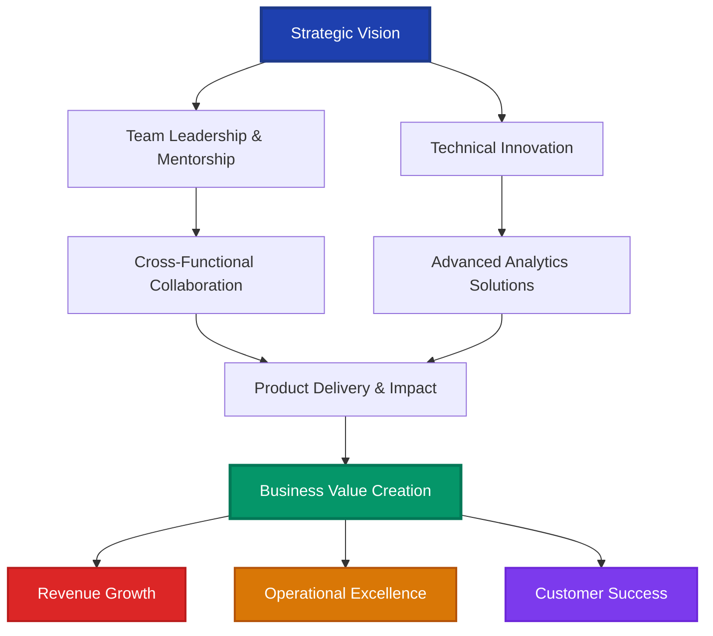
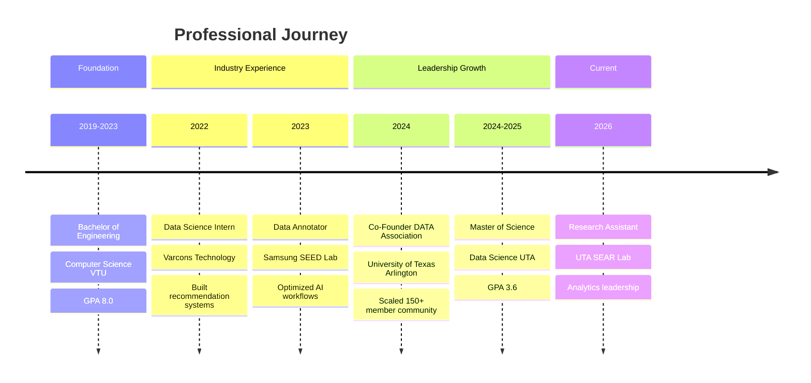
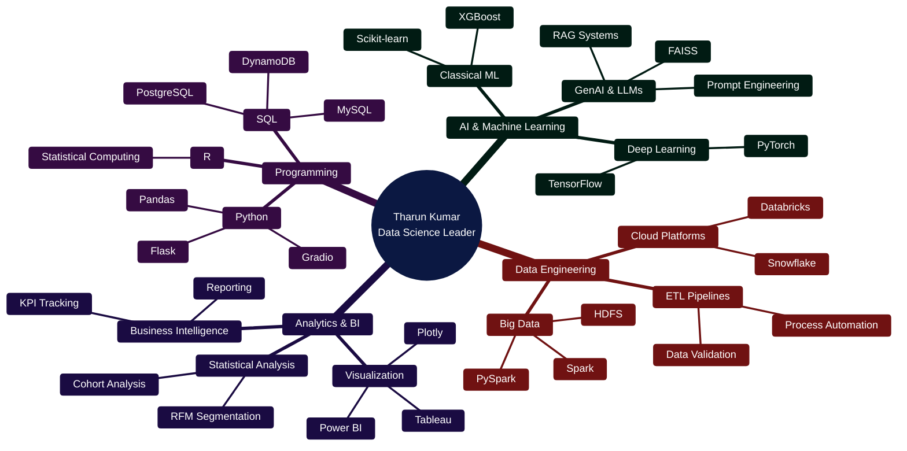

[%20883--3846-25D366?style=for-the-badge&logo=whatsapp&logoColor=white)](tel:+18178833846)

---

## 🎯 Executive Summary

Accomplished **Data Science Leader** and **AI Innovation Strategist** with a proven track record of driving business transformation through advanced analytics, machine learning, and GenAI solutions. Currently completing Master of Science in Data Science at the University of Texas at Arlington (GPA: 3.6/4.0), with demonstrated expertise in leading cross-functional teams, scaling data-driven initiatives, and delivering measurable business impact.

As **Co-Founder** of DATA (Data Analytics and Technology Association) at UTA, successfully scaled a 150+ member analytics community, orchestrated 15+ enterprise-grade data science projects, and led strategic datathons engaging 200+ participants. Previously contributed to Samsung SEED Lab's AI initiatives, optimizing computer vision annotation workflows that improved model training efficiency by 25% and reduced error rates by 20% across production systems serving millions of users.

### 🏆 Leadership Impact Dashboard

| **Metric** | **Achievement** | **Business Impact** |
|:-----------|:----------------|:--------------------|
| **Teams Led** | 150+ member community | Scaled analytics organization at UTA |
| **Projects Delivered** | 15+ data science initiatives | Cross-functional team coordination |
| **Operational Efficiency** | 40% reduction in preprocessing time | Automated validation workflows |
| **Model Performance** | 25% improvement in training efficiency | Enhanced AI production systems |
| **Revenue Optimization** | 15% engagement increase | Behavioral analytics for 10K+ users |
| **Cost Reduction** | 25% query latency reduction | Optimized ETL data pipelines |
| **Quality Improvement** | 30% annotation accuracy gain | Deep learning model enhancement |
| **Process Innovation** | 20% error rate reduction | Semantic segmentation optimization |

---

## 💼 Leadership Philosophy

> *"Data science leadership is about transforming complex technical challenges into strategic business solutions. I believe in empowering teams through mentorship, driving innovation through collaboration, and delivering measurable impact through data-driven decision-making. My approach combines technical excellence with strategic vision to build scalable analytics solutions that drive organizational growth."*

---

## 📊 Strategic Impact Framework

---

## 🚀 Career Progression Timeline

---

## 🎖️ Key Strategic Achievements

### 🏢 Organizational Leadership & Team Development

**Co-Founder, DATA (Data Analytics and Technology Association) | UTA Data Science Department**
*September 2024 - December 2025*

- **Community Building**: Architected and scaled a 150+ member analytics community from inception, establishing UTA's premier data science organization
- **Strategic Initiatives**: Led 15+ enterprise-grade data science projects, delivering hands-on training and mentorship to 200+ participants through strategic datathons and workshops
- **Cross-Functional Leadership**: Coordinated multi-disciplinary teams and industry mentorship programs, fostering collaboration between academia and industry
- **Educational Impact**: Designed comprehensive analytics curriculum and workshop series, accelerating skill development across the data science community

### 📈 Research Leadership & Innovation

**Research Assistant (Data Analytics) | University of Texas at Arlington – SEAR Lab**
*January 2026 - Present*

- **Strategic Analysis**: Led comprehensive analysis of 15,000+ RFID commissioning records across multiple deployment environments, quantifying 12% variance in read accuracy and identifying critical operational performance gaps
- **Process Automation**: Architected and deployed Python and SQL data validation workflows, reducing preprocessing time by 40% and significantly improving downstream data reliability across 50+ experimental datasets
- **Research Impact**: Produced statistical performance analyses and interactive dashboards supporting 3 concurrent research initiatives, enabling 8-15% optimization improvements in controlled system evaluations
- **Technical Leadership**: Established best practices for data quality assurance and automated pipeline development within the research lab

### 💡 AI Innovation & Production Systems

**Data Annotator | Samsung SEED Pvt Ltd**
*May 2023 - December 2023*

- **AI Model Optimization**: Executed semantic segmentation on millions of image pixels, implementing advanced interaction techniques that reduced annotation error rates by 20% and improved downstream model accuracy by 15%
- **Tool Innovation**: Leveraged Samsung R&D's proprietary annotation tool Datagen to refine image annotation accuracy by 30%, enhancing deep learning model training efficiency by 25% across multiple AI initiatives
- **Production Scale**: Optimized annotation workflows and data processing pipelines serving millions of users, reducing time-to-production for computer vision models
- **Cross-Team Collaboration**: Partnered with cross-functional AI teams to streamline operations and accelerate production deployment at enterprise scale

### 🔧 Product Development & Revenue Impact

**Data Science Intern | Varcons Technology Pvt Ltd**
*April 2022 - September 2022*

- **Product Innovation**: Designed and implemented end-to-end recommendation pipeline processing 500K+ user records, delivering personalized diet insights to 10K+ users
- **Business Impact**: Increased user engagement by 15% through advanced behavioral pattern analysis and machine learning-driven personalization
- **Infrastructure Development**: Developed SQL-based ETL data pipelines using MySQL and PostgreSQL for large-scale user data, reducing query latency by 25% and enabling real-time analytics
- **Backend Architecture**: Created scalable backend analytics services using Python and Flask, partnering with product and engineering teams to translate business requirements into measurable data science solutions

---

## 🛠️ Executive Technology Stack

### Core Competencies

**Programming & Analytics**

**AI & Machine Learning**

**GenAI & LLMs**

**Data Engineering**

**Databases**

**Visualization & BI**

**DevOps & Tools**

---

## 🎯 Featured Strategic Projects

### 1️⃣ GenAI-Powered Academic Analytics & Semantic Question-Answering System (RAG)

**Strategic Impact**: Production-ready enterprise AI solution transforming information discovery

**Technical Leadership**:
- Architected production-ready GenAI Q&A system integrating SQL data, FAISS semantic search, and LLMs with intent-aware query routing
- Implemented intelligent routing directing factual queries to SQL retrieval and interpretive queries to RAG for optimal accuracy
- Achieved 85% Top-5 retrieval accuracy on semantic search benchmarks
- Reduced information discovery time by 40% through optimized vector embeddings and recommendation logic

**Business Value**: Enhanced decision-making capabilities through AI-powered knowledge management

**Technology Stack**: SQL, FAISS, LLMs, RAG, Gradio, PostgreSQL

---

### 2️⃣ E-Commerce Customer Analytics & Retention Analysis

**Strategic Impact**: Data-driven insights driving customer retention strategy

**Technical Leadership**:
- Built comprehensive end-to-end e-commerce analytics platform analyzing 100K+ transactions
- Uncovered revenue trends, customer behavior patterns, and key drivers across products and regions
- Performed advanced cohort analysis and RFM segmentation identifying critical retention challenges
- Discovered extremely low retention (<1%) and high dependence on at-risk customers

**Business Value**: Delivered actionable insights to improve customer retention and long-term revenue growth strategy

**Technology Stack**: SQL, Python, Tableau

---

### 3️⃣ Real-Time Warehouse Inventory & AI-Assisted Logistics Optimization System

**Strategic Impact**: Enterprise-scale logistics transformation through AI and real-time analytics

**Technical Leadership**:
- Designed and engineered real-time inventory tracking system across 50+ warehouses using Python and Spark
- Achieved sub-second latency with 100% synchronization accuracy
- Developed ML-based incident resolution models reducing resolution time by 21%
- Improved warehouse-to-delivery workflows using advanced routing analytics

**Business Value**: 
- 7.5% reduction in logistics costs
- Enhanced pipeline reliability through data quality monitoring
- Improved operational efficiency across multi-site distribution network

**Technology Stack**: Python, Spark, Machine Learning

---

## 📚 Technical Expertise Breakdown

---

## 🌟 Mentorship & Team Development

### Leadership Initiatives

**🎓 Community Building & Education**
- Founded and scaled DATA (Data Analytics and Technology Association) to 150+ active members
- Designed and delivered 15+ comprehensive data science workshops and training programs
- Mentored 200+ aspiring data scientists through hands-on datathons and project collaborations
- Established industry